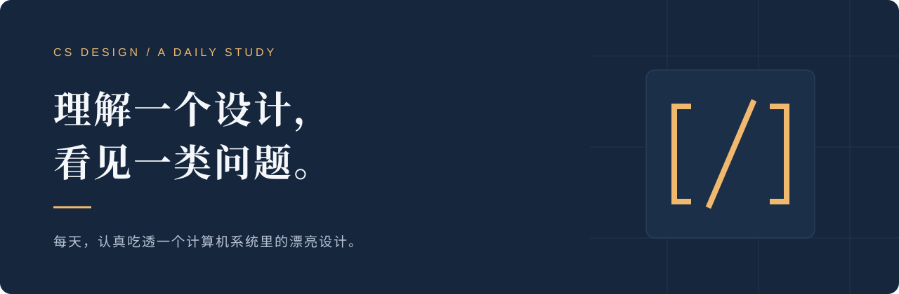

<div align="center">



# 一日一设计

**每天，认真吃透一个计算机系统里的漂亮设计。**

中文长文 · 贯穿推演 · 原始来源 · 持续积累

[**开始阅读 ↗**](https://wang29a.github.io/cs-design-daily/) · [从五篇讲义开始](#reading-map) · [关于每日更新](#daily-publishing)

[](https://github.com/wang29a/cs-design-daily/actions/workflows/pages.yml)

</div>

---

## 把知识读成判断力

AI 让获取答案变得越来越容易，也让判断答案的能力变得越来越重要。一个设计为什么成立，它究竟解决了什么矛盾，又在哪些条件下会失效——这些问题，需要留出时间认真思考。

「一日一设计」是一份持续生长的计算机系统阅读笔记。每天选一个值得理解的设计，从具体问题走进机制，再从机制走向背后的思想。我们希望读完之后，你不仅能说出它的名字，还能追踪它的状态、解释它的因果，并判断什么时候值得采用它。

> 理解一个设计，看见一类问题。

## 一篇讲义，走完一条因果链

每一讲都从一个真实的矛盾开始。先尝试最自然的方案，找到它无法继续的位置，再引出关键洞察。随后用一个贯穿例子跟踪输入、状态变化、输出和结束条件，把抽象机制变成可以复述的过程。

讲解会追问设计必须守住的不变量，也会推演一个故障或反事实：如果破坏这个条件，系统到底会在哪里出错？理解成立的原因之后，再讨论它付出的代价、适用的边界，以及同一种思想如何出现在其他系统中。

篇幅通常约 2000—3000 中文字，服从讲透的需要。正文以连续讲解为主，代码与公式只在能帮助理解时出现。来源放在对应论述附近，优先查阅官方文档、原始论文和源码；教学推演、本机演示与实际测量会明确区分。

<a id="reading-map"></a>

## 从这五讲开始

这五篇讲义覆盖了系统设计中几种反复出现的思路：组合、间接层、恢复、共享，以及用有限资源覆盖等待。

| 讲义 | 从一个问题走进去 | 领域 |
| :--- | :--- | :--- |
| [01 · Unix 管道](https://wang29a.github.io/cs-design-daily/lessons/2026-10-01-unix-pipe/) | 怎样让互不认识的程序协作？ | 操作系统 |
| [02 · 虚拟内存](https://wang29a.github.io/cs-design-daily/lessons/2026-10-02-virtual-memory/) | 怎样用一层映射改变资源的分配方式？ | 内存管理 |
| [03 · WAL](https://wang29a.github.io/cs-design-daily/lessons/2026-10-03-wal/) | 怎样在随时可能中断的世界里确认一次修改？ | 数据库 |
| [04 · Git 对象与引用](https://wang29a.github.io/cs-design-daily/lessons/2026-10-04-git-objects/) | 怎样让完整版本共享同一份未变化内容？ | 版本控制 |
| [05 · TCP 滑动窗口](https://wang29a.github.io/cs-design-daily/lessons/2026-10-05-tcp-window/) | 怎样把等待变成可控的并行？ | 网络 |

后续讲义会继续加入[在线阅读页](https://wang29a.github.io/cs-design-daily/)的日期归档。你可以从最新一讲开始，也可以沿着自己的兴趣回看。

## 留一点时间，检验自己是否真的理解

读到关键转折时，先停下来想一想：如果由我来设计，最先会尝试什么？读完贯穿例子后，试着不用原文复述一次状态变化。最后改变一个条件——缓冲区满了、确认丢了、提交中断了——看看自己能否推导出后果。

一个设计的名字很容易记住。能解释它为什么必须这样做，才是这份笔记希望留下的东西。

<a id="daily-publishing"></a>

## 每天更新，长期可读

每日讲义由本机 Codex 定时任务生成，计划在北京时间 **05:00** 执行。完成来源核对与正文检查后，更新阅读页，经 GitHub CLI 提交到这个仓库，由 GitHub Actions 部署到 GitHub Pages。发布流程会检查部署结果，并核对公网内容与本次页面一致。

网页托管在 GitHub Pages，阅读不依赖本机开机。新内容的生成仍依赖本机和 Codex 正常运行；任务未成功执行时，既有讲义会继续保留。同一天不会重复追加，往期内容可以持续回看。

## 内容是源，页面是结果

每篇讲义是独立的 Markdown 文件，日期、标题、领域和关键洞察由目录管理。模板描述阅读界面，CSS 与 JavaScript 负责展示及交互，构建器将它们组合成首页、归档和每篇文章的独立页面。新增一讲时无需改写 HTML，也无需修改前端代码。

```text
content/
  catalog.json          日期、标题、领域与源文件映射
  lessons/*.md          每篇讲义的完整正文
templates/              首页、归档、阅读页与共享布局
assets/                 样式、交互与标识
scripts/
  build.py              验证内容并生成网站
  publish.py            验证新讲义后追加目录
tests/                  内容发布与构建不变量
dist/                   生成结果，不提交到版本库
```

GitHub Actions 从这些源文件运行检查并构建 `dist/`，然后发布到 Pages。构建失败时不会发布候选结果；重复日期、缺失正文和未关闭的代码围栏都会被拒绝。每次构建生成文件哈希清单，用于确认公网内容对应本次源文件。

在仓库根目录运行 `python3 scripts/build.py` 可以复现网站。构建仅使用 Python 标准库；阅读页面无需 JavaScript 也能打开全文和导航，脚本只增强领域筛选、阅读进度及旧书签兼容。

---

<div align="center">

**一天一个设计，一次认真理解。**

[打开阅读页](https://wang29a.github.io/cs-design-daily/)

</div>
